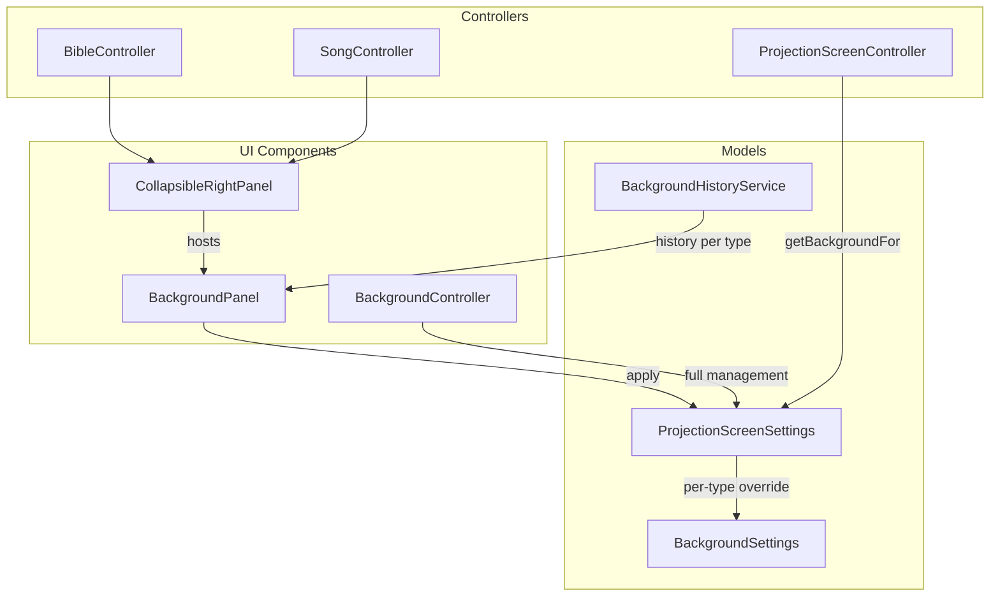

# Background Settings by ProjectionType

## Current State

- **ProjectionScreenSettings** ([ProjectionScreenSettings.java](c:\Saját\workspace\Projector\projector-desktop\src\main\java\projector\application\ProjectionScreenSettings.java)): Single background (color/image) per projection screen; falls back to global Settings
- **ProjectionScreenController** ([ProjectionScreenController.java](c:\Saját\workspace\Projector\projector-desktop\src\main\java\projector\controller\ProjectionScreenController.java)): Applies `projectionScreenSettings` background when displaying (lines 347-382); tracks `projectionType` (BIBLE, SONG, SONG_ENDING, etc.)
- **Bible.fxml** / **Song.fxml**: No collapsible right panel; Song has `rightBorderPane` with verse list
- **MainView.fxml**: TabPane with fixed tabs; Settings opens via menu in separate window

## Architecture Overview

## Implementation Plan

### 1. Background model and per-type storage

**BackgroundSettings** (new POJO in `projector.application`):

- `Color backgroundColor`, `String backgroundImagePath`, `boolean isBackgroundImage`
- Serializable for persistence

**ProjectionScreenSettings** changes:

- Add `Map<ProjectionType, BackgroundSettings> backgroundByType` (or explicit fields for BIBLE, SONG, SONG_ENDING to keep it simple)
- New methods: `getBackgroundColor(ProjectionType)`, `getBackgroundImagePath(ProjectionType)`, `isBackgroundImage(ProjectionType)` with fallback: type-specific -> default
- Persist in existing JSON/settings file format

### 2. ProjectionScreenController background resolution

In [ProjectionScreenController.java](c:\Saját\workspace\Projector\projector-desktop\src\main\java\projector\controller\ProjectionScreenController.java) `setBackgroundBySettings()` (line 347):

- Use `projectionScreenSettings.getBackgroundColor(projectionType)` instead of `getBackgroundColor()`
- Same for image path and isBackgroundImage
- Only BIBLE, SONG, SONG_ENDING use type-specific; others use default

### 3. CollapsibleRightPanel (reusable component)

**New files:**

- `view/CollapsibleRightPanel.fxml` - BorderPane with:
  - Left: narrow strip with collapse/expand ToggleButton (chevron icon)
  - Center: `StackPane` as content placeholder (`fx:id="contentPane"`)
- `CollapsibleRightPanelController.java` - `setContent(Node)`, `setCollapsed(boolean)`, `isCollapsed()`, toggle animation

**Usage:** Include in Bible.fxml and Song.fxml; wrap existing right-side content or add as additional right panel.

### 4. BackgroundPanel (compact background chooser)

**New files:**

- `view/BackgroundPanel.fxml` - Compact: ColorPicker, RadioButton color/image, TextField+Browse for image, "Apply" button
- `BackgroundPanelController.java` - Takes `ProjectionType` and `ProjectionScreenHolder` (or `ProjectionScreenController`); applies to that screen's settings; calls `ProjectionScreenController.setBackGroundColor2()` to refresh

**BibleController:** Add CollapsibleRightPanel on the right of the main SplitPane; content = BackgroundPanel configured for `ProjectionType.BIBLE`.

**SongController:** Add CollapsibleRightPanel; content = BackgroundPanel with tabs or toggle for SONG vs SONG_ENDING (or two compact panels). Song.fxml already has `rightBorderPane` - the CollapsibleRightPanel can be a third column in the SplitPane or a nested panel.

### 5. Background history with previews

**BackgroundHistoryService** (new, in `projector.service` or `projector.application`):

- `Map<ProjectionType, List<BackgroundSettings>> history` (max 8-10 per type)
- `addToHistory(ProjectionType, BackgroundSettings)` when user applies
- `getHistory(ProjectionType)` for UI
- Persist to file (e.g. `backgroundHistory.json` in app data)

**BackgroundPanelController** enhancements:

- Horizontal list of history items; each is a small `Pane` (e.g. 48x32) with background applied (color fill or image)
- Click to apply that background
- Use `ProjectionScreenController.getBackgroundByPath()` for image preview

### 6. BackgroundController tab

**New files:**

- `view/Background.fxml` - Tab content with sections per ProjectionType (BIBLE, SONG, SONG_ENDING); each has full BackgroundPanel + history
- `BackgroundController.java` - Manages all types; needs `ProjectionScreenHolder` or main projection screen

**Integration:**

- Add "Backgrounds" MenuItem under Settings menu (or as submenu)
- On action: add Tab to MainView TabPane if not present, select it; Tab `closable=true`
- Similar pattern to [MyController.openPdfViewerTab](c:\Saját\workspace\Projector\projector-desktop\src\main\java\projector\controller\MyController.java) (lines 467-492)

### 7. Layout integration

**Bible.fxml:** Current structure is `StackPane > SplitPane(vertical) > [left: horizontalSplitPane, right: BorderPane with verse list]`. Add CollapsibleRightPanel as right sibling of the verse BorderPane (new SplitPane or HBox), or as right of the outer SplitPane.

**Song.fxml:** Structure is `BorderPane.center > SplitPane > [left: leftBorderPane, right: rightBorderPane]`. Add CollapsibleRightPanel as third pane in SplitPane (splitter between rightBorderPane and new panel), or nest inside rightBorderPane.

### 8. Resource bundles

Add keys: `Background`, `Backgrounds`, `Song ending background`, `Bible background`, `Background history` (or reuse existing `Background color`, `Background image`).

## File Summary

| Action | File                                                                              |
| ------ | --------------------------------------------------------------------------------- |
| New    | `BackgroundSettings.java`                                                         |
| New    | `BackgroundHistoryService.java`                                                   |
| New    | `CollapsibleRightPanel.fxml` + `CollapsibleRightPanelController.java`             |
| New    | `BackgroundPanel.fxml` + `BackgroundPanelController.java`                         |
| New    | `Background.fxml` + `BackgroundController.java`                                   |
| Modify | `ProjectionScreenSettings.java` - per-type background storage                     |
| Modify | `ProjectionScreenController.java` - use type-specific background                  |
| Modify | `Bible.fxml` - add CollapsibleRightPanel with BackgroundPanel                     |
| Modify | `Song.fxml` - add CollapsibleRightPanel with BackgroundPanel (Song + Song ending) |
| Modify | `MainDesktop.java` + `MyController.java` - menu item for Background tab           |
| Modify | `MainView.fxml` - optional: no change if tab added dynamically                    |
| Modify | `language_*.properties` - new keys                                                |

## Simplifications (Phase 1)

- Start with only BIBLE, SONG, SONG_ENDING having type-specific backgrounds; others use default
- History: max 8 items per type; simple list, no complex UI
- Background tab: single screen (main) only initially; multi-screen later if needed
- CollapsibleRightPanel: simple show/hide, no animation initially

